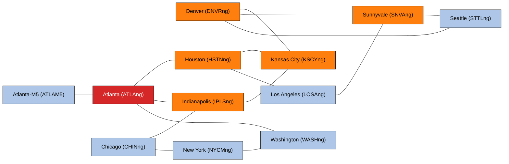
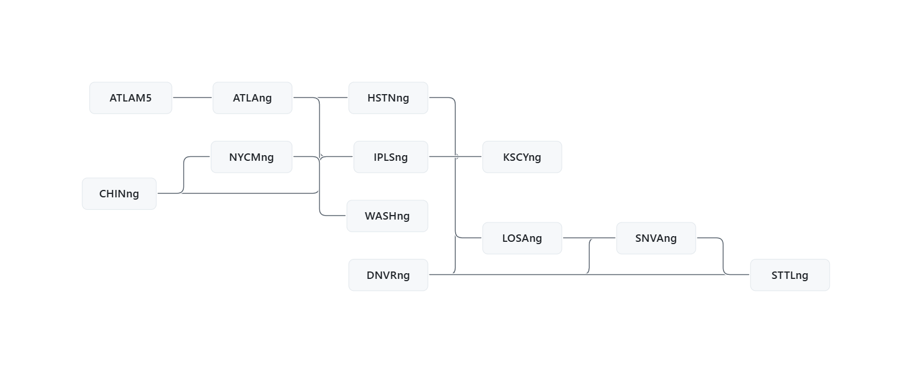
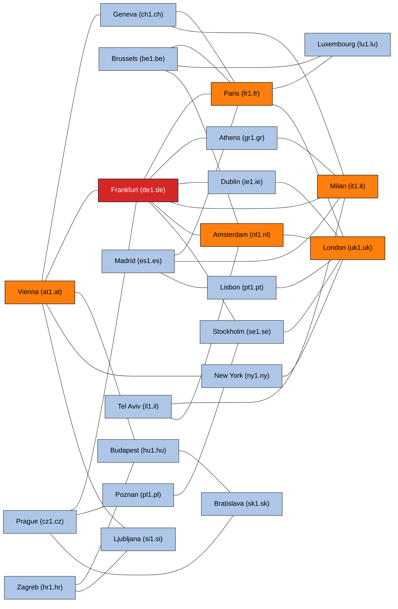
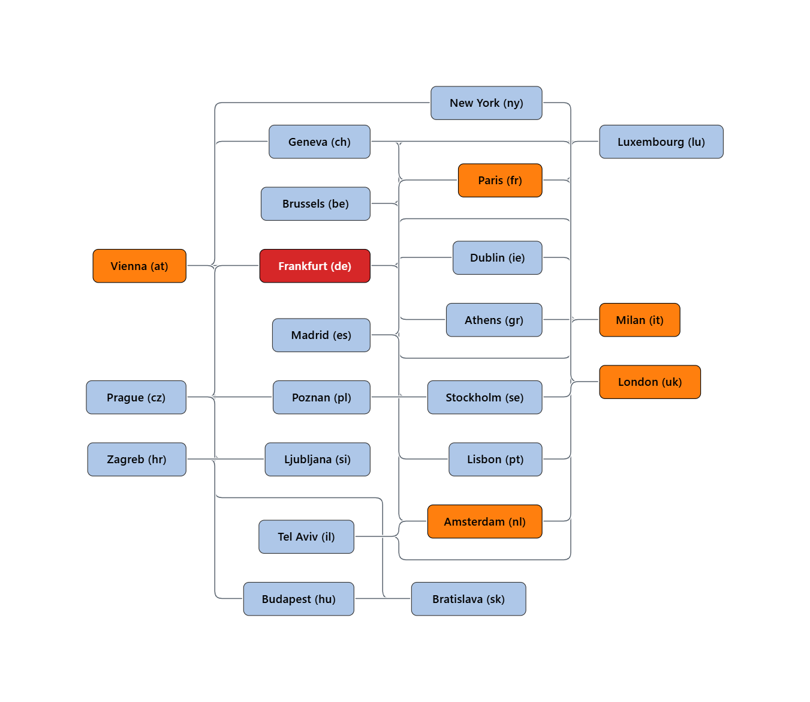

# Data

Datasets used by this project.

| Dataset | Location | Description |
|---------|----------|-------------|
| crosscheck-samples | [`crosscheck-samples/`](crosscheck-samples/) | Abilene (2004) & GÉANT (2005) network traffic-matrix samples, 1000 snapshots each. |

---

## crosscheck-samples

Two pickled pandas DataFrames of network telemetry:
[`crosscheck-samples/abilene_sample_1000.pkl`](crosscheck-samples/abilene_sample_1000.pkl)
and [`crosscheck-samples/geant_sample_1000.pkl`](crosscheck-samples/geant_sample_1000.pkl).

The dataset's own **authoritative schema** (file format, cell structure, noise model,
metadata columns) lives in [`crosscheck-samples/README.md`](crosscheck-samples/README.md).
This section adds a **detailed data dictionary** derived by recomputation from the data:
the meaning of every row and column family, the recovered network topology (with diagrams),
and the structural relationships (invariants) that hold among the columns.

Every structural figure, edge, and ratio below was verified directly from the pickles — see
[Reproducing this section](#reproducing-this-section).

### Contents

1. [What a row means](#what-a-row-means)
2. [What the columns mean](#what-the-columns-mean)
3. [Reading a value out of a cell](#reading-a-value-out-of-a-cell)
4. [Structural relationships (invariants)](#structural-relationships-invariants)
5. [Abilene network](#abilene-network)
6. [GÉANT network](#géant-network)
7. [Abilene vs GÉANT at a glance](#abilene-vs-géant-at-a-glance)
8. [Caveats & assumptions](#caveats--assumptions)
9. [Reproducing this section](#reproducing-this-section)

---

### What a row means

Each **row is one complete network snapshot** at a single timestamp: every interface
counter and every origin→destination demand measured during that interval.

| | Abilene | GÉANT |
|--|---------|-------|
| Sampling interval | **30 minutes** | **30 minutes** |
| Time span of the 1000 samples | 2004‑03‑01 00:00 → 2004‑04‑08 19:30 UTC | 2005‑05‑04 15:30 → 2005‑05‑25 11:00 UTC |
| Index | `RangeIndex` 0…999 | `RangeIndex` 0…999 |

The `timestamp` column is a string formatted `YYYY/MM/DD HH:MM UTC`
(parse with `pd.to_datetime(df["timestamp"], format="%Y/%m/%d %H:%M UTC")`).

### What the columns mean

Columns fall into three families: **low-level interface counters** (`low_*`),
**high-level demands** (`high_*`), and **metadata** (9 columns).

| Family | Abilene | GÉANT | Meaning |
|--------|--------:|------:|---------|
| `low_<NODE>_origination`        | 12 | 22 | Traffic **entering** the network at a node (from external/customer interfaces). |
| `low_<NODE>_termination`        | 12 | 22 | Traffic **leaving** the network at a node (to external/customer interfaces). |
| `low_<NODE>_egress_to_<NBR>`    | 30 | 72 | Traffic a node **sends** onto a backbone link toward an adjacent node (one per directed link). |
| `low_<NODE>_ingress_from_<NBR>` | 30 | 72 | Traffic a node **receives** from an adjacent node (one per directed link). |
| **low total**                   | **84** | **188** | Per-interface counters (SNMP-style link reads). |
| `high_<SRC>_<DST>`              | 144 | 484 | End-to-end **demand** from source to destination = the traffic matrix (`N²`). |
| **metadata**                    | 9 | 9 | Bookkeeping (`timestamp` + inert perturbation/repair/validation fields). |
| **total**                       | **237** | **681** | |

- **`origination` / `termination`** — external traffic at a node; exactly one of each per
  node. `origination` enters the backbone there; `termination` exits it.
- **`egress_to` / `ingress_from`** — directional counters on the **backbone links**. They
  exist **only between physically adjacent nodes**, so the set of these columns *is* the
  topology. Each undirected link is read at both ends in both directions (four counters per
  link), and the adjacency is symmetric: every `low_X_egress_to_Y` has a matching
  `low_Y_egress_to_X`. The number of `egress_to` columns therefore equals the number of
  **directed** links (30 Abilene, 72 GÉANT = 2 × undirected).
- **`high_S_D`** — the **origin→destination demand matrix** (traffic matrix): end-to-end
  traffic from `S` to `D`, independent of path. Full `N × N`, with self-pairs
  `high_X_X = 0` exactly. Demands are routed over the topology to produce the `low_*` link
  loads.

### Reading a value out of a cell

Every `low_*`/`high_*` cell is a **dict**, not a scalar
(`hidden_ground_truth` = clean, `ground_truth` = clean + measurement noise; see the dataset
README for the full noise model). Unwrap it like so:

```python
import pandas as pd, numpy as np
df = pd.read_pickle("crosscheck-samples/geant_sample_1000.pkl")

def field(cell, which="ground_truth"):
    """One value field from a low_*/high_* cell; fall back to the clean field."""
    if isinstance(cell, dict):
        return cell.get(which) if cell.get(which) is not None else cell.get("hidden_ground_truth")
    return cell  # metadata columns are plain scalars

# A whole column as clean floats:
orig = df["low_de1.de_origination"].map(lambda c: field(c, "hidden_ground_truth")).astype(float)

# The full demand matrix at timestamp t:
nodes = sorted(c[len("low_"):-len("_origination")]
               for c in df.columns if c.endswith("_origination"))
t = 0
TM = np.array([[field(df.loc[t, f"high_{s}_{d}"]) for d in nodes] for s in nodes], float)
```

Use `hidden_ground_truth` for the **clean** signal (`low_*`), and `ground_truth` for
`high_*` demands (no separate clean field is provided for demands).

### Structural relationships (invariants)

Physical/structural constraints that *should* hold by the nature of network traffic data,
each tested empirically over all **1000 snapshots of both datasets**.

**Separating signal from noise.** Every `low_*` cell carries a clean `hidden_ground_truth`
and a noisy `ground_truth` (clean + injected measurement noise); every `high_*` cell carries
only `ground_truth` (its `hidden_ground_truth` is `None`), treated as the noise-free demand.
**All structural tests below run on the clean fields** (`hidden_ground_truth` for `low_*`,
`ground_truth` for `high_*`); the noisy `low_*` `ground_truth` is used *only* to characterise
the noise (I12) and to size tolerance bands. Exact invariants are checked at `0` / `1e-9`
relative; approximate ones that must mix in noisy values use an empirical band of
`5·p99 ≈ 0.34` to absorb the heavy-tailed noise.

Shorthand (all per snapshot): `o_X = low_X_origination`, `t_X = low_X_termination`,
`e_{X→Y} = low_X_egress_to_Y`, `i_{X←Y} = low_X_ingress_from_Y`, `H[s,d] = high_s_d`.

#### Catalog & validation

| # | Invariant | Formal statement | Strictness | Deviation — Abilene / GÉANT (clean) | Verdict |
|---|-----------|------------------|-----------|--------------------------------------|---------|
| I1 | Non-negativity | every `low_*`, `high_*` value ≥ 0 | exact | 0 / 0 negative cells | ✅ holds |
| I2 | Zero self-demand | `H[X,X] = 0` ∀ X | exact | max\|·\| = 0 / 0 | ✅ holds |
| I3 | Topology symmetry | link `X→Y` present ⇔ `Y→X` present | exact | all 30 / all 72 directed links reverse-paired | ✅ holds |
| I4 | Link two-end agreement | `e_{X→Y} = i_{Y←X}` | exact on clean | clean max\|resid\| = 0 / 0 | ✅ exact on clean; differs only by noise on `ground_truth` |
| I5 | Origination = demand row-sum | `o_X = Σ_d H[X,d]` | approx | ratio median 0.981 (mean 0.977) / 0.982 (mean 0.979) | ◑ systematic ~2% deficit (structural) |
| I6 | Termination = demand col-sum | `t_X = Σ_s H[s,X]` | approx | ratio median 0.981 / 0.982 | ◑ systematic ~2% deficit (structural) |
| I7 | Node flow conservation | `o_X + Σ_Y i_{X←Y} = t_X + Σ_Y e_{X→Y}` | approx | rel-resid mean 0.17%, max 1.0% / mean 0.15%, max 2.9% | ◑ holds within band (fraction in band = 1.000) |
| I8 | Network totals balance | `Σ_X o_X ≈ Σ_X t_X`; `Σ_X o_X ≈ Σ_{s,d} H[s,d]`; row-total = col-total | approx / exact | Σo/Σt = 1.0003, Σo/Σ H = 0.977 / 1.0001, 0.978 | ✅ in≈out; demand row-total = col-total exactly |
| I9 | Directionality (anti-symmetry) | `e_{A→B} ≠ e_{B→A}` in general | sanity | mean rel gap 0.43 / 0.75 | ✅ confirmed directional (not mislabeled duplicates) |
| I10 | Demand → link routing | each `H[S,D]` routes over the topology into the `low_*` link loads | structural | not reconstructed here | ⚪ inferred — assumed by construction, not directly tested |
| I11 | Capacity bound | per-link load ≤ link capacity | — | no capacity column; counter units ambiguous | ⚪ untestable |
| I12 | Measurement-noise model | `(ground_truth − hidden)/hidden` ~ zero-mean, small | characterise | 82.8% perturbed, mean −4e‑5, std ~2%, p99\|rel\| 6.7%, max\|rel\| 0.82 / 81.9% perturbed, max\|rel\| 0.97 | ◑ zero-mean; defines the tolerance band |

Legend: ✅ holds · ◑ holds approximately / systematic offset · ⚪ not validated here.
*GÉANT contains **14 fully-empty snapshots** (all counters and demands = 0, i.e. missing
intervals); these are excluded from the ratio statistics above. Abilene has none.*

#### What each invariant means

**Exact, within a single layer (I1–I4).**
- **I1 Non-negativity** — every column is a byte/volume count, so negatives are impossible;
  any would signal corruption. Zero negatives anywhere.
- **I2 Zero self-demand** — `H[X,X]` is traffic from a node to itself, which never enters the
  backbone, so the demand-matrix diagonal is structurally zero by definition.
- **I3 Topology symmetry** — backbone links are bidirectional, so a counter for `X→Y` exists
  **iff** one for `Y→X` exists. The `egress_to`/`ingress_from` column set *is* the topology,
  and it is perfectly paired (every directed link has its reverse).
- **I4 Link two-end agreement** — `e_{X→Y}` (what X sends toward Y) and `i_{Y←X}` (what Y
  receives from X) are **two readings of the same physical directed link**, taken at opposite
  ends. They are identical on clean data (residual exactly 0); on `ground_truth` they differ
  *only* because each end got an independent noise draw — i.e. every violation is injected
  noise, never structure. This is the tightest invariant.

**Cross-layer and aggregate (I5–I8).** These tie the link-counter layer (`low_*`) to the
traffic-matrix layer (`high_*`).
- **I5 Origination = demand row-sum** — everything a node injects (`o_X`) must be headed to
  *some* destination, and the matrix **row** for X enumerates those destinations, so
  `o_X = Σ_d H[X,d]`.
- **I6 Termination = demand col-sum** — mirror image: everything delivered at X (`t_X`) came
  from *some* source, enumerated by the matrix **column**, so `t_X = Σ_s H[s,X]`.
- **I7 Node flow conservation** — Kirchhoff's law for traffic: a router is neither a source
  nor a sink of bytes over an interval, so locally-injected + arriving-from-neighbours =
  locally-delivered + forwarded-to-neighbours. Holds to ~0.15%; the small residual is
  inherited from the I5/I6 layer mismatch.
- **I8 Network totals balance** — globally, total traffic entering ≈ total leaving
  (`Σ o_X ≈ Σ t_X`, the sum of all I7 balances with internal links cancelling via I4), and
  total origination ≈ the grand total of the demand matrix. Summing that matrix by rows vs.
  columns gives the **same** total — an exact algebraic identity.

**Sanity & characterisation (I9–I12).**
- **I9 Directionality** — a deliberate *anti*-invariant: real traffic is asymmetric, so
  `e_{A→B} ≠ e_{B→A}`. A large gap (mean relative 0.43 / 0.75) confirms the counters are
  genuinely directional rather than mislabeled duplicates. (Contrast I4, which is equality
  between the two *ends of one direction*; I9 is inequality between *opposite directions*.)
- **I10 Demand → link routing** — by construction the demands are routed over the topology to
  produce the link loads. Reconstructing the routing matrix is out of scope here, so this is
  reported as **inferred**, not validated.
- **I11 Capacity bound** — link utilisation should never exceed capacity, but there is no
  capacity column and the counter units are ambiguous, so utilisation cannot be formed:
  **untestable** (assumption only).
- **I12 Measurement-noise model** — not a property of the network but of the injected
  perturbation. The relative noise on `low_*` is ~zero-mean (≈ −4e‑5, so it does not bias the
  structural sums), small (std ≈ 2%), heavy-tailed (rare spikes up to 0.82 Abilene / 0.97
  GÉANT), and present on ~82% of cells. Its 99th-percentile `|relative deviation| ≈ 6.7%`
  sets the `5·p99 ≈ 0.34` tolerance band used for I7/I8.

#### Key finding — the ~2% origination/termination deficit (I5/I6)

`origination` and `termination` are **not** exactly equal to the demand row/column sums:
they run a **systematic ~2% below**, and the deficit is *extremely uniform across every node*
(per-node ratios 0.974–0.983 in both datasets) and **sign-consistent**. Median
`origination / Σ demand` ≈ **0.981** (Abilene) / **0.982** (GÉANT); the mean is ≈ 0.977 /
0.979. Because the injected noise (I12) is zero-mean, it cannot produce a one-sided 2% gap —
so this is a **real structural mismatch between the SNMP-style counter layer (`low_*`) and
the estimated traffic-matrix layer (`high_*`)** (a classic SNMP-vs-TM discrepancy: overhead,
a layer/units difference, or how the matrix was estimated). It is the one non-obvious
finding, it appears **identically in both datasets**, and it is exactly what keeps I7 from
being exact.

### Abilene network

**Abilene** was the Internet2 backbone across the continental United States. 12 router
nodes, 15 undirected backbone links. The `ng` suffix denotes the "next-generation"
routers; `ATLAM5` is a secondary Atlanta node attached only to `ATLAng`.

| Code | Location | Code | Location |
|------|----------|------|----------|
| `ATLAng` | Atlanta, GA | `KSCYng` | Kansas City, MO |
| `ATLAM5` | Atlanta, GA (secondary "M5" PoP) | `LOSAng` | Los Angeles, CA |
| `CHINng` | Chicago, IL | `NYCMng` | New York, NY |
| `DNVRng` | Denver, CO | `SNVAng` | Sunnyvale, CA |
| `HSTNng` | Houston, TX | `STTLng` | Seattle, WA |
| `IPLSng` | Indianapolis, IN | `WASHng` | Washington, D.C. |

Degrees: `ATLAng` 4 (eastern hub); `DNVRng`, `HSTNng`, `IPLSng`, `KSCYng`, `SNVAng` 3;
`CHINng`, `LOSAng`, `NYCMng`, `STTLng`, `WASHng` 2; `ATLAM5` 1.



Rendered topology figure (same 12 nodes / 15 links as the diagram above):



Column tally: `84 low` (12 + 12 + 30 + 30) + `144 high` (= 12²) + `9 meta` = **237**.

### GÉANT network

**GÉANT** was the pan-European research & education backbone interconnecting national
research networks (NRENs). 22 PoP nodes, 36 undirected backbone links. Node IDs follow
`‹cc›1.‹cc›`, where `cc` is the ISO‑3166 country code of the PoP.

| Code | Country — city (PoP) | Code | Country — city (PoP) |
|------|----------------------|------|----------------------|
| `at1.at` | Austria — Vienna | `it1.it` | Italy — Milan |
| `be1.be` | Belgium — Brussels | `lu1.lu` | Luxembourg |
| `ch1.ch` | Switzerland — Geneva | `nl1.nl` | Netherlands — Amsterdam |
| `cz1.cz` | Czechia — Prague | `ny1.ny` | USA — New York (transatlantic PoP) |
| `de1.de` | Germany — Frankfurt | `pl1.pl` | Poland — Poznań |
| `es1.es` | Spain — Madrid | `pt1.pt` | Portugal — Lisbon |
| `fr1.fr` | France — Paris | `se1.se` | Sweden — Stockholm |
| `gr1.gr` | Greece — Athens | `si1.si` | Slovenia — Ljubljana |
| `hr1.hr` | Croatia — Zagreb | `sk1.sk` | Slovakia — Bratislava |
| `hu1.hu` | Hungary — Budapest | `uk1.uk` | United Kingdom — London |
| `ie1.ie` | Ireland — Dublin | | |
| `il1.il` | Israel — Tel Aviv | | |

> Country codes are authoritative (read from the data); the city for each PoP is the
> conventional GÉANT location and is **inferred**, not encoded in the dataset.

Degrees reveal the core: **Frankfurt `de1.de` 8** (central hub); **Paris `fr1.fr` 6** and
**London `uk1.uk` 6**; **Vienna `at1.at` 5** and **Milan `it1.it` 5**;
**Amsterdam `nl1.nl` 4**. Ten degree-2 PoPs sit at the edge.



Rendered topology figure (same 22 nodes / 36 links as the diagram above):



Column tally: `188 low` (22 + 22 + 72 + 72) + `484 high` (= 22²) + `9 meta` = **681**.

### Abilene vs GÉANT at a glance

| | Abilene | GÉANT |
|--|---------|-------|
| Region | Continental USA (Internet2) | Europe + transatlantic (NRENs) |
| Node naming | US city codes, `…ng` suffix | ISO country codes, `cc1.cc` |
| Nodes | 12 | 22 |
| Undirected backbone links | 15 | 36 |
| Directed link counters | 60 | 144 |
| `low_*` columns | 84 | 188 |
| `high_*` demand columns | 144 (12²) | 484 (22²) |
| Metadata columns | 9 | 9 |
| **Total columns** | **237** | **681** |
| Snapshots | 1000 | 1000 |
| Sampling interval | 30 min | 30 min |
| Highest-degree node | `ATLAng` (4) | `de1.de` (8) |
| Median `origination / Σ demand` | 0.981 | 0.982 |

### Caveats & assumptions

- **GÉANT has 22 nodes, not 23.** Verified: `484 = 22²` demand columns and 22 origination
  interfaces. The dataset's own `README.md` states 23 — that figure is off by one.
- **GÉANT cities are inferred.** Country codes come from the data; the specific PoP city is
  the conventional GÉANT location.
- **Demand cells have no separate clean field** — `high_*` `hidden_ground_truth` is usually
  `None`; `ground_truth` is used as the clean demand.
- **The ~2% origination/termination deficit (I5/I6) is structural, not noise** — consistent
  across all nodes/snapshots and identical in both datasets.
- **These are base datasets** — all fault/repair/validation fields are inert; treat the data
  as clean ground truth (optionally + measurement noise).
- **Read-only.** The pickles are not modified by any analysis here.

### Reproducing this section

All figures above were recomputed from the pickles:

```python
import pandas as pd

def field(c, which="ground_truth"):
    if isinstance(c, dict):
        return c.get(which) if c.get(which) is not None else c.get("hidden_ground_truth")
    return c

for path in ["crosscheck-samples/abilene_sample_1000.pkl",
             "crosscheck-samples/geant_sample_1000.pkl"]:
    df = pd.read_pickle(path)
    low  = [c for c in df.columns if c.startswith("low_")]
    nodes = sorted(c[4:-len("_origination")] for c in low if c.endswith("_origination"))
    edges = {frozenset((c[4:c.index("_egress_to_")],
                        c[c.index("_egress_to_")+len("_egress_to_"):]))
             for c in low if "_egress_to_" in c}
    ts = pd.to_datetime(df["timestamp"], format="%Y/%m/%d %H:%M UTC")
    print(path, "| rows", len(df), "| nodes", len(nodes),
          "| links", len(edges), "| interval", ts.diff().mode().iloc[0])
```

Expected output:

```
crosscheck-samples/abilene_sample_1000.pkl | rows 1000 | nodes 12 | links 15 | interval 0 days 00:30:00
crosscheck-samples/geant_sample_1000.pkl   | rows 1000 | nodes 22 | links 36 | interval 0 days 00:30:00
```

A fuller exploration — column-parsing helpers, distributions, and the invariant validation
(Section 16) — lives in [`../crosscheck_exploration.ipynb`](../crosscheck_exploration.ipynb)
at the repository root.
